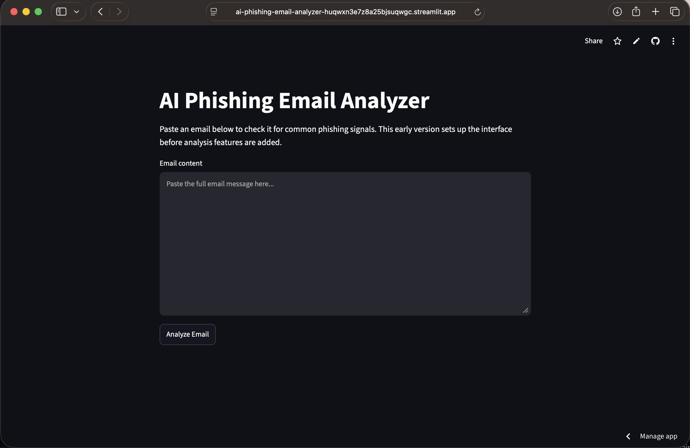
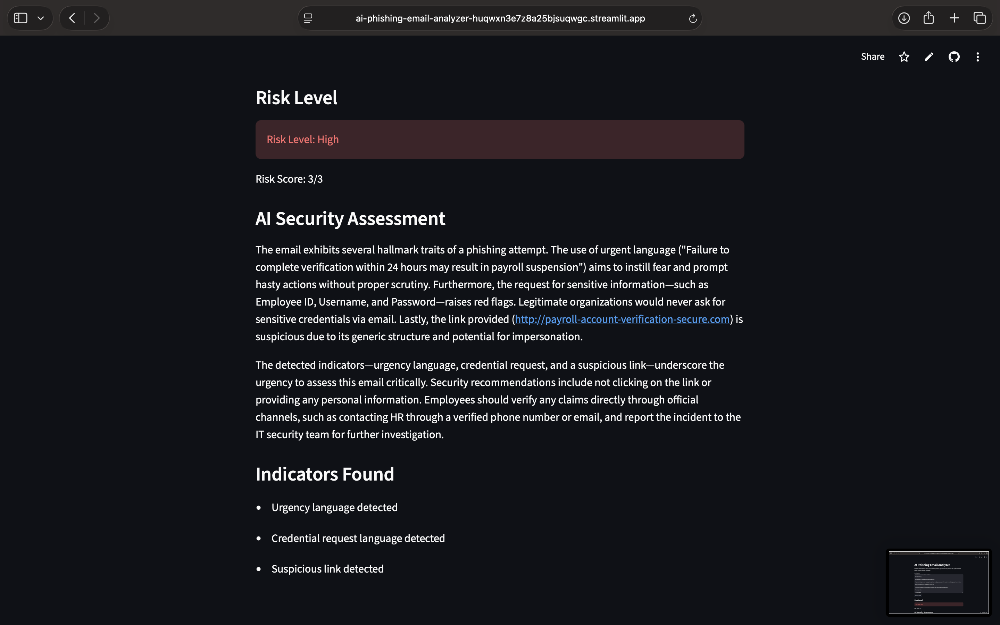
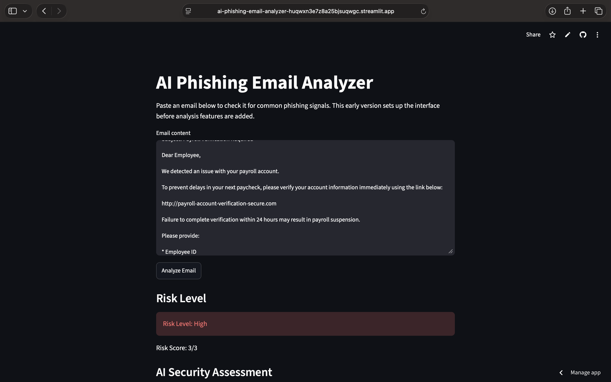

# AI Phishing Email Analyzer

An AI-powered cybersecurity application that analyzes email content for phishing indicators, calculates a phishing risk score, and generates explainable security assessments using OpenAI GPT.

## Live Demo

https://ai-phishing-email-analyzer-huqwxn3e7z8a25bjsuqwgc.streamlit.app

## Overview

The AI Phishing Email Analyzer combines rule-based phishing detection with Large Language Model (LLM) analysis to help identify potentially malicious emails.

Users can paste email content into a web interface, and the application will:

* Detect common phishing indicators
* Calculate a phishing risk score
* Classify risk as Low, Medium, or High
* Generate an AI-powered security assessment
* Provide actionable security recommendations

This project demonstrates practical skills in cybersecurity, artificial intelligence, Python development, API integration, secure credential management, cloud deployment, and web application development.

---

## Screenshots

### Homepage



### Detection Results



### AI Security Assessment



---

## Features

### Phishing Indicator Detection

The application analyzes email content for:

* Urgency language
* Credential requests
* Suspicious links
* Social engineering indicators

### Risk Scoring

Emails are assigned:

* Low Risk
* Medium Risk
* High Risk

based on detected phishing characteristics.

### AI Security Assessment

OpenAI GPT generates:

* Plain-language phishing explanations
* Security reasoning
* User recommendations
* Risk justification

### Interactive Web Interface

Built with Streamlit for quick and accessible analysis.

---

## Architecture

```text
Email Input
      ↓
Rule-Based Indicator Detection
      ↓
Risk Scoring Engine
      ↓
OpenAI GPT Analysis
      ↓
Security Assessment Output
```

---

## Technology Stack

### Languages

* Python

### Libraries & Frameworks

* Streamlit
* OpenAI Python SDK
* python-dotenv

### Cloud & Dev Tools

* Git
* GitHub
* Streamlit Community Cloud

### Security Concepts

* Phishing Detection
* Social Engineering Indicators
* Risk Assessment
* Explainable Security Analysis

---

## Project Structure

```text
ai-phishing-email-analyzer/
├── app.py
├── analyzer.py
├── prompts.py
├── requirements.txt
├── risk_scoring.py
│
├── utils/
│   ├── indicators.py
│   └── url_checker.py
│
├── sample_emails/
│   ├── phishing_example.txt
│   └── safe_example.txt
│
├── screenshots/
│   ├── Homepage.png
│   ├── Results.png
│   └── Test Message.png
│
└── tests/
```

---

## Installation

Clone the repository:

```bash
git clone https://github.com/tjijo/ai-phishing-email-analyzer.git
cd ai-phishing-email-analyzer
```

Create and activate a virtual environment:

```bash
python3 -m venv .venv
source .venv/bin/activate
```

Install dependencies:

```bash
pip install -r requirements.txt
```

---

## Environment Variables

Create a `.env` file in the project root:

```env
OPENAI_API_KEY=your_openai_api_key
```

Important:

* Never commit `.env` files to GitHub.
* Store API keys securely.
* Use environment variables for sensitive credentials.

---

## Running the Application

Start the Streamlit application:

```bash
streamlit run app.py
```

Open:

```text
http://localhost:8501
```

in your browser.

---

## Example Workflow

### Input

```text
URGENT ACTION REQUIRED

Your account has been suspended.

Please verify your credentials immediately:

http://secure-account-verification-login.com
```

### Detection Results

* Urgency language detected
* Credential request detected
* Suspicious link detected

### Risk Score

```text
Risk Level: High
Risk Score: 3/3
```

### AI Security Assessment

The application generates an explanation describing:

* Why the email appears suspicious
* Which phishing indicators were detected
* Recommended security actions

---

## Skills Demonstrated

This project demonstrates:

* Cybersecurity analysis
* Phishing detection concepts
* AI integration using OpenAI APIs
* Prompt engineering
* Python development
* API integration
* Environment variable management
* Git and GitHub workflows
* Cloud deployment
* Streamlit web application development

---

## Future Improvements

Potential enhancements include:

* Sender reputation analysis
* Domain reputation checks
* URL extraction and inspection
* Attachment analysis
* Email header analysis
* OCR support for image-based phishing emails
* Historical scan storage
* PDF report generation
* Local LLM support using Ollama

---

## Disclaimer

This project was developed for educational and portfolio purposes.

It should not be used as a production-grade phishing detection system and should not be relied upon as the sole method of identifying malicious emails.

Always follow organizational security policies and verify suspicious communications through trusted channels.
